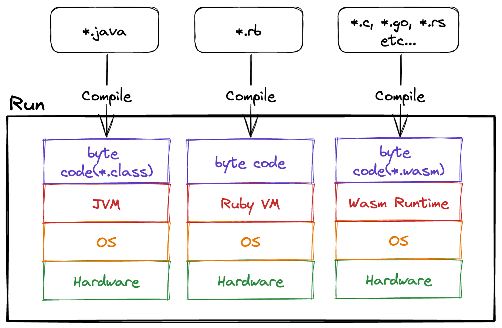
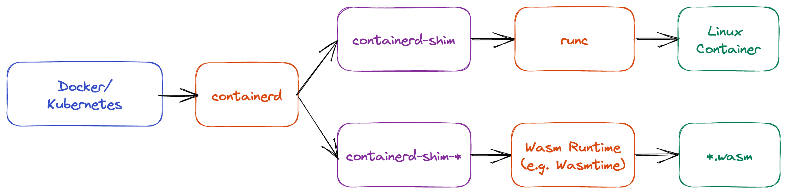

# Overview of Wasm

In this chapter, we will mainly explain the following about Wasm:

- Overview of Wasm Runtime
- Pros and Cons of Wasm
- Use cases of Wasm

## Overview of Wasm Runtime
As mentioned in the previous chapter, Wasm is a virtual instruction set.
The Wasm Runtime, which reads and executes these virtual instructions, is essentially a virtual machine itself.

When we talk about virtual machines, we can think of Java VM or RubyVM, and Wasm Runtime falls into the same category.
Java and Ruby compile source code to generate bytecode, which is then executed by the virtual machine. Similarly, Wasm follows a similar process.

However, as shown in Figure 1, a notable feature of Wasm is its ability to be compiled from various languages such as C, Go, and Rust.

*Figure 1*

This book will essentially implement a virtual machine similar to Java VM or RubyVM. 
The Wasm Runtime itself is not very complex, capable of performing numerical calculations and memory operations that it possesses.

One might wonder if tasks like standard output are possible. In fact, resource operations (such as file or network operations) are not included in the Wasm Spec but are part of the [WebAssembly System Interface (WASI)](https://wasi.dev) specification.
WASI consists of a collection of POSIX-like system call functions, allowing resource operations by calling these functions.

For this instance, we will implement the `fd_write` function of WASI to output `Hello World`.

## Pros and Cons of Wasm

The author's perspective on the pros and cons of Wasm are as follows.

### Pros
- **Secure Execution**  
  Without using WASI, Wasm Runtime generally does not have an impact outside the runtime, making it a kind of sandbox environment.  
  For example, it is secure as it cannot extract confidential information from environment variables.
- **Portability**  
  Wasm is independent of the OS and CPU, allowing execution anywhere with a runtime.  
  It can be executed in major browsers like Google Chrome, Firefox, and Microsoft Edge.  
  Besides major browsers, there are runtimes like [Wasmtime](https://wasmtime.dev) and [wazero](https://wazero.io) for server-side execution.
- **Language Diversity**  
  Wasm can be compiled from multiple languages, enabling the utilization of assets from various languages.  
  Additionally, it can import other Wasm binaries, facilitating the sharing of language assets across language barriers.

### Cons
- **Lack of Support in Older Browsers**  
  Although rare, older browsers may not support Wasm, leading to the inability to execute Wasm binaries.  
  In such cases, using a library like [polywasm](https://github.com/evanw/polywasm) can enable running Wasm.
- **Evolving Technology**  
  Wasm is a relatively new technology, with ongoing specification extensions alongside WASI.  
  As a result, the ecosystem is still maturing, making it challenging to build full-fledged applications solely with Wasm.
- **Performance Depends on Runtime**  
  Performance differences can arise based on the implementation of the runtime.  
  For instance, executing in Chrome and Wasmtime involves different runtimes, necessitating consideration of this aspect in benchmark comparisons.  
  When comparing the execution speed of Wasm binaries, measurements should be done with the same runtime, and when measuring runtime speed, it should be done with the same Wasm binary.

## Use Cases of Wasm
We will introduce several examples of scenarios where Wasm is being utilized.

### Plugin Systems
Due to Wasm's ability to be compiled from multiple languages, it is often adopted in building plugin mechanisms.
For example, the terminal multiplexer called [zellij](https://github.com/zellij-org/zellij) utilizes Wasm. For more details, refer to [this link](https://zellij.dev/news/new-plugin-system/).

In addition, the Envoy Proxy server also provides a mechanism for extending functionality using Wasm.

### Serverless Applications
By using the spin framework, you can build serverless applications with Wasm.
In addition to spin, there are other options such as wasmCloud and Wasmer Edge.

### Containers
In addition to Linux containers in Docker and Kubernetes, you can also use Wasm.
To explain how Docker and Kubernetes run Linux containers and Wasm, an overview is provided based on Figure 2.

*Figure 2*

- `containerd`
  - Manages container images (such as retrieval and deletion) and operations on containers (such as creation and start)
  - Also known as a high-level container runtime
- `runc`
  - Actually creates and starts Linux containers
  - Also known as a low-level container runtime
- `containerd-shim`
  - Bridges `containerd` and `runc`
  - Essentially just an execution binary
- `containerd-shim-*`
  - Bridges `containerd` and `Wasm Runtime`
  - Essentially just an execution binary
  - There are execution binaries like `containerd-shim-wasmtime` and `containerd-shim-wasmedge`
  - When implementing `containerd-shim-*` in Rust, use [runwasi](https://github.com/containerd/runwasi)

## Summary
This chapter provides a brief introduction to the Wasm Runtime and the ecosystem using Wasm.
In the next chapter, we will actually use Wasm with Wasmtime.

[^1]: Assumes that the Runtime implementation is free of vulnerabilities.
