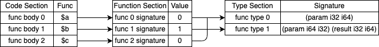
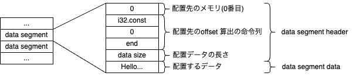

# Structure of Wasm Binary

When the Wasm Runtime executes a Wasm binary, there are two main steps: decoding the Wasm binary and processing instructions.
To decode the binary, it is necessary to understand the structure of the binary, so this chapter will explain that structure.

By the end of this chapter, you will understand what the structure of the binary looks like.

## Overview of Wasm Binary
A Wasm binary consists of an 8-byte preamble at the beginning, followed by various sections.

The preamble consists of the `Magic Number` `'\0asm'` and the version value `1`, each occupying 4 bytes at the beginning of the file.

The following is a modified output of a binary generated by `wat2wasm -v`, with some additional explanations.

```
           \0asm
         ┌───┴───┐
0000000: 0061 736d      ; WASM_BINARY_MAGIC
~~~~~~~  ~~             ~~~~~~~~~~~~~~~~~~~~ 
 │        │                   │
 │        │                   └ Comment
 │        └ Hexadecimal notation, 2 digits = 1 byte
 └ Offset of address

0000004: 0100 0000      ; WASM_BINARY_VERSION
```

In the explanations of the binary structure that follow, we will generally use this output with some added clarity.

There are multiple sections, each storing information necessary for execution at runtime.
For example, there is information about function signatures, memory initialization, and instructions to be executed.

It is worth noting that sections are optional, so it is possible to create a minimal Wasm binary consisting only of the preamble.

In this document, we will implement the following sections, so for other sections, please refer to the [specification](https://www.w3.org/TR/wasm-core-1/#sections%E2%91%A0).

| Section            | Description                          |
|--------------------|--------------------------------------|
| `Type Section`     | Information about function signatures |
| `Code Section`     | Information about instructions per function |
| `Function Section` | Reference information to function signatures |
| `Memory Section`   | Information about linear memory       |
| `Data Section`     | Information about data to be placed in memory during initialization |
| `Export Section`   | Information about exporting to other modules |
| `Import Section`   | Information about importing from other modules |

Subsequently, we will explain the data structures of each section.

### [Type Section](https://www.w3.org/TR/wasm-core-1/#type-section%E2%91%A0)

An area that holds function signature information.
In brief, a signature refers to the type of a function.

A function signature is uniquely determined by the following combination:

- Types and order of arguments
- Types and order of return values

For example, functions `$a` and `$b` in List 1 have differences in argument order and presence of return values, so they have different signatures, but `$a` and `$c` have the same signature.
Signatures essentially define the input and output of a function, independent of the function's content, so `$a` and `$c` will reference the same signature information.

```wat:List 1
(module
  (func $a (param i32 i64))
  (func $b (param i64 i32) (result i32 i64)
    (local.get 1)
    (local.get 0)
  )
  (func $c (param i32 i64))
)
```

Function signatures provide information on how many arguments and return values to push onto the stack when executing a function.
The detailed usage of signature information will be explained in the chapter on `Runtime` implementation.

List 2 represents the binary structure.

```:List 2
; section "Type" (1)
0000008: 01       ; section code
0000009: 0d       ; section size
000000a: 02       ; num types
; func type 0
000000b: 60       ; func       
000000c: 02       ; num params 
000000d: 7f       ; i32        
000000e: 7e       ; i64        
000000f: 00       ; num results
; func type 1
0000010: 60       ; func       
0000011: 02       ; num params 
0000012: 7e       ; i64        
0000013: 7f       ; i32        
0000014: 02       ; num results
0000015: 7f       ; i32        
0000016: 7e       ; i64        
```

The first 2 bytes represent the `section code` and `section size`, which are common to all sections.
Although they do not have an official name, we will refer to them as section headers in this document.

```
; section "Type" (1)
0000008: 01          ; section code
0000009: 0d          ; section size
000000a: 02          ; num types
```

The `section code` is a unique value used to identify the section, with `1` representing the `Type Section`.

The `section size` indicates the number of bytes in the section data excluding the first 2 bytes.
This helps determine how much of the binary needs to be read when decoding the section.

`num types` represents the number of function signatures. For each of these, the function signatures will be decoded.

The remaining part of the section defines function signatures. Each function signature starts with `0x60` and is defined in the order of the number and types of arguments, followed by the number and types of return values.

In List 3, `func type 0` contains the signature information of `(func $a (param i32 i64))` and `(func $c (param i32 i64))`, while `func type 1` contains the signature information of `(func $b (param i64 i32) (result i32 i64))`.

```:List3
; func type 0
000000b: 60    ; func         ┐                              
000000c: 02    ; num params   │ (func $a (param i32 i64)) 
000000d: 7f    ; i32          ├ (func $c (param i32 i64)) 
000000e: 7e    ; i64          │                           
000000f: 00    ; num results  ┘                           
; func type 1
0000010: 60    ; func         ┐                     
0000011: 02    ; num params   │                     
0000012: 7e    ; i64          │ (func $b            
0000013: 7f    ; i32          ├   (param i64 i32)   
0000014: 02    ; num results  │   (result i32 i64)  
0000015: 7f    ; i32          │ )                   
0000016: 7e    ; i64          ┘                     
```

Decoding function signatures generally involves the following steps:

1. Read 1 byte and verify if it is `0x60`.
2. Read 1 byte to obtain the number of arguments.
3. Read the bytes corresponding to the number obtained in step 2.
   For example, if it is 2, read 2 bytes.
4. Read through the bytes obtained in step 3 one by one to get the type information corresponding to the values (e.g., if `0x7e`, it represents the i64 type).
5. Obtain the return value type information following steps 2 to 4.

### [Code Section](https://www.w3.org/TR/wasm-core-1/#code-section%E2%91%A0)

The `Code Section` primarily stores the instruction information of functions.

List 4 represents the binary structure of the `Code Section`.

```:List4
; section "Code" (10)
000001d: 0a           ; section code
000001e: 0e           ; section size
000001f: 03           ; num functions
; function body 0
0000020: 02           ; func body size
0000021: 00           ; local decl count
0000022: 0b           ; end
; function body 1
0000023: 06           ; func body size
0000024: 00           ; local decl count
0000025: 20           ; local.get
0000026: 01           ; local index
0000027: 20           ; local.get
0000028: 00           ; local index
0000029: 0b           ; end
; function body 2
000002a: 02           ; func body size
000002b: 00           ; local decl count
000002c: 0b           ; end
```

`num functions` indicates the number of functions, and you decode functions based on this number.

The remaining part consists of the definitions of local variables and instruction information for each function, which need to be decoded iteratively.

`func body size` indicates the number of bytes in the function body.

`local decl count` indicates the number of local variables.
If it is `0`, no action is taken, but if it is greater than `1`, the subsequent byte sequence defines the types of local variables.

The byte sequence up to `end` represents the function instructions, and the `Runtime` processes these instructions.

Decoding functions generally involves the following steps:

1. Read 1 byte to obtain the size of the function.
2. Read the byte sequence corresponding to the function size obtained in step 1.
3. Read 1 byte to obtain the number of local variables.
4. Read through the bytes obtained in step 3 one by one to get the type information.
5. Obtain the instructions until the byte sequence read in step 2 is exhausted.

### [Function Section](https://www.w3.org/TR/wasm-core-1/#function-section%E2%91%A0)

The `Function Section` holds information that links function bodies (`Code Section`) with type information (`Type Section`).

List 5 represents the binary structure.

```:List5
; section "Function" (3)
0000017: 03              ; section code
0000018: 04              ; section size
0000019: 03              ; num functions
000001a: 00              ; function 0 signature index
000001b: 01              ; function 1 signature index
000001c: 00              ; function 2 signature index
```

The value of `function x signature index` represents the index information (0-based) to the function signature.
For example, `function 2` indicates that it has the signature `0` from the `Type Section`.

To clarify the relationship, refer to Figure 1.



*Figure 1*

### [Memory Section](https://www.w3.org/TR/wasm-core-1/#memory-section%E2%91%A0)

The `Memory Section` stores information on how much memory to allocate for the `Runtime`.

Memory can be extended in page units, with 1 page being 64KiB as specified in the [specification](https://www.w3.org/TR/wasm-core-1/#memory-instances%E2%91%A0).

Memory is formatted as `(memory $initial $max)` as shown in List 6, where `2` represents the initial memory page count, and `3` represents the maximum page count.
`max` is optional, and if not specified, there is no upper limit.

```:List6
(module
  (memory 2 3)
)
```

The binary structure is represented as shown in List 7.

```:List7
; section "Memory" (5)
0000008: 05             ; section code
0000009: 04             ; section size
000000a: 01             ; num memories
; memory 0
000000b: 01             ; limits: flags
000000c: 02             ; limits: initial
000000d: 03             ; limits: max
```

`num memories` indicates the number of memories, but in version 1 of the specification, only one memory can be defined per module, making this value effectively fixed at 1.

`limits: flags` is a value used to determine whether `max` exists, meaning that if it is `0`, only `initial` exists, and if it is `1`, both `initial` and `max` exist. This allows you to understand how to decode it.

### [Data Section](https://www.w3.org/TR/wasm-core-1/#data-section%E2%91%A0)

The `Data Section` is the area where data to be placed after memory allocation in the `Runtime` is defined. In other words, it defines the initial data of the memory.

List 8 is an example defining the string `Hello, World!\n` in memory.

```:リスト8
(module
  (memory 1)
  (data 0 (i32.const 0) "Hello, World!\n")
)
```

The data is formatted as `(data $memory $offset $data)` and consists of the following elements:

- `$memory` is the index of the memory where the data is placed
- `$offset` is the instruction sequence to calculate the offset of the memory to place the data
- `$data` is the actual data to be placed in memory

In this example, the string `Hello, World!\n` is placed in the 0th byte of the 0th memory.

The binary structure is as shown in List 9.

```:リスト9
; section "Data" (11)
000000d: 0b                                   ; section code
000000e: 14                                   ; section size
000000f: 01                                   ; num data segments
; data segment header 0
0000010: 00                                   ; segment flags
0000011: 41                                   ; i32.const
0000012: 00                                   ; i32 literal
0000013: 0b                                   ; end
0000014: 0e                                   ; data segment size
; data segment data 0
0000015: 4865 6c6c 6f2c 2057 6f72 6c64 210a   ; data segment data
```

The data is organized into units called `segments`, and there may be multiple `segments`. A `segment` consists of `header` and `data` areas, where `header` contains the instruction sequence to calculate the offset and `data` holds the actual data.

`num data segments` is the number of `segments`.

The `data segment header` is the area that holds metadata such as the memory where the data is placed and the offset. There is one for each `segment`.

`segment flags` indicate the index of the memory where the data is placed. In version 1, only one memory can be defined, so it is effectively fixed at 0.

From `i32.const` to `end` is the instruction sequence to calculate the offset. In this case, only fixed values are handled, but global values can also be referenced.

`data segment size` is the length of the actual data to be placed, and `data segment data` is the actual data to be placed in memory.

Figure 2 illustrates the structure of the `segment` in List 9.



*Figure 2*

### [Export Section](https://www.w3.org/TR/wasm-core-1/#export-section%E2%91%A0)

The `Export Section` is the area where information accessible from other modules is defined. In version 1, memories, functions, etc., can be exported.

On the `Runtime` side, only exported functions can be called, so if, for example, a function to perform addition needs to be called from the `Runtime`, the function must be exported.

List 10 is an example of exporting the function `$dummy` that the module itself has as `dummy`.

```:リスト10
(module
  (func $dummy)
  (export "dummy" (func $dummy))
)
```

The export format is `(export $name ($type $index))`. `$name` is the name to be exported, `$type` is the type of data to be exported such as `func` or `memory`, and `$index` is the index or name of that data. For example, in the case of `func 0`, it refers to the 0th function. In this example, the function name `$dummy` is specified, but it will be converted to an index when it becomes binary.

The binary structure is as shown in List 11.

```:リスト11
; section "Export" (7)
0000012: 07                   ; section code
0000013: 09                   ; section size
0000014: 01                   ; num exports
0000015: 05                   ; string length
0000016: 6475 6d6d 79         ; export name (dummy)
000001b: 00                   ; export kind
000001c: 00                   ; export func index
```

`num exports` is the number of data to be exported.

`string length` is the length of the byte sequence of the exported name, and `export name` is the actual byte sequence of characters.

`export kind` is the type of data, where for memory it is `0x02`.

`export func index` is the index of the function to be exported.

### [Import Section](https://www.w3.org/TR/wasm-core-1/#import-section%E2%91%A0)

`Import Section` is an area where information is defined to import entities such as memory and functions that exist outside the module. The term "outside the module" refers to memory and functions provided by other modules or the `Runtime`.

In this case, we are implementing WASI, and the actual implementation of WASI functions is done on the `Runtime` side, so we plan to import and use them.

List 12 is an example of importing a function named `add` from a module called `adder`.

```:List 12
(module
  (import "adder" "add" (func (param i32 i32) (result i32)))
)
```

The import format is `(import $module $name $type)`.

`$module` is the module name, `$name` is the name of the function or memory to import, and `$type` contains the type definition information. For functions, it includes the function's signature information, and for memory, it defines the `min` and `max` information of the memory.

The binary structure looks like List 13.

```:List 13
; section "Type" (1)
0000008: 01                ; section code
0000009: 07                ; section size
000000a: 01                ; num types
; func type 0
000000b: 60                ; func
000000c: 02                ; num params
000000d: 7f                ; i32
000000e: 7f                ; i32
000000f: 01                ; num results
0000010: 7f                ; i32
; section "Import" (2)
0000011: 02                ; section code
0000012: 0d                ; section size
0000013: 01                ; num imports
; import header 0
0000014: 05                ; string length
0000015: 6164 6465 72      ; import module name (adder)
000001a: 03                ; string length
000001b: 6164 64           ; import field name (add)
000001e: 00                ; import kind
000001f: 00                ; import signature index
```

`string length` represents the length of the byte sequence of the characters, `import module name` represents the byte sequence of the actual module name, and `import field name` represents the byte sequence of the function or memory name to import.

`import kind` indicates the type of import, where `0` is used for functions.

`import signature index` points to the index of the function's signature information, referring to `func type 0` in the `Type Section`.

## Summary
In this chapter, we explained the sections targeted for implementation. If you are not familiar with handling binaries, it may seem challenging, but we recommend revisiting this chapter repeatedly until you become comfortable with it.

In the next chapter, we will proceed with implementing the process of decoding a Wasm binary.
