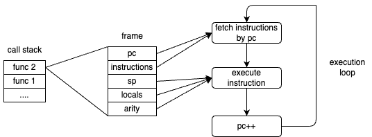

# Mechanism of Function Execution

Executing a function means processing the instructions the function holds in a loop.
In this chapter, we will explain how the Wasm Runtime processes functions.

## Execution of Instructions

In Wasm Runtime, the execution of instructions can be broadly divided into the following steps:

1. Fetching instructions using the program counter
2. Processing the fetched instructions
    - In this step, operations on the stack, local variables, etc., are also performed
3. Incrementing the program counter

The program counter refers to the value that points to the address of the next instruction to be executed.
In Wasm Runtime, instructions are represented as an array, so the program counter becomes the value of the array index.

Representing this in pseudocode would look like the following.

```rust
let instructions = vec![...];      // Instruction sequence
let mut stack: Vec<i32> = vec![];  // Stack
let mut locals: Vec<i32> = vec![]; // Local variables
let mut pc: usize = 0;             // Program counter

loop {
    if let Some(instruction) = instructions.get(pc) else {
        break;
    };

    match instruction {
        inst::LocalGet => { ... }
        inst::I32Add => { ... }
        ...
    }

    pc += 1;
}
```

## Frame

A frame is a data structure that holds the necessary information for the execution of a function.
Details about various items will be discussed later.

- Program counter (pc)
- Stack pointer (sp)
- Instruction sequence (instructions)
- Number of return values (arity)
- Arguments and local variables (locals)

When executing a function, a frame is created, and processing is done based on this information.
In the Wasm Runtime implementation we are working on, frames are represented as follows.

```rust
#[derive(Default)]
pub struct Frame {
    pub pc: isize,
    pub sp: usize,
    pub insts: Vec<Instruction>,
    pub arity: usize,
    pub locals: Vec<Value>,
}
```

## Call Stack

The stack area that holds frames.
When executing a function, a frame is created and pushed onto the call stack.
Once the function execution is complete, it is popped from the call stack.

The relationship between the call stack, frames, and instruction execution can be illustrated as follows.
The program counter and instruction sequence are used during instruction fetching, while the other information is used during instruction processing.



## Stack Pointer

The call stack is stacked each time a function is executed, but there is always only one stack.
Therefore, a common stack area is used between functions.

Since it is a common area, it is necessary to rewind the stack when a function execution is completed.

For example, if there are functions `func1` and `func2` that have processes to push values onto the stack.
When `func1` calls `func2` during its execution, and `func2` finishes its execution with values pushed onto the stack, when returning to `func1`, the values pushed by `func2` remain on the stack.
Therefore, it is necessary to rewind the stack to the state it was in when `func1` called `func2`.
The stack pointer is the information needed to know how far to rewind the stack.

## Arguments and Local Variables

Wasm functions can have arguments and local variables.
Since arguments are essentially local variables, they are saved in the `locals` of the frame.

When calling a function from another function, let's briefly explain how arguments are passed to the function.
Before executing a function, a frame is created. If there are functions that receive arguments, the arguments are `pop`ed from the stack and `push`ed into `locals`.

This allows the use of local variables when executing the function.

## Number of Return Values

Wasm functions can return values.
When the function execution is completed and the stack is rewound, if there are return values, they are `pop`ed from the stack first before rewinding.
After that, the `pop`ed values are `push`ed back onto the stack.

This way, the result of the function execution is stacked, allowing the caller to continue processing.
Thinking of the function execution result being stacked is similar to pushing `1` onto the stack like `i32.const 1`, which might make it easier to visualize.

## Summary
We have explained the mechanism of function execution in Wasm.
There are aspects that may not be fully understood until implemented, so in the next chapter, we will proceed with the implementation to deepen the understanding.
